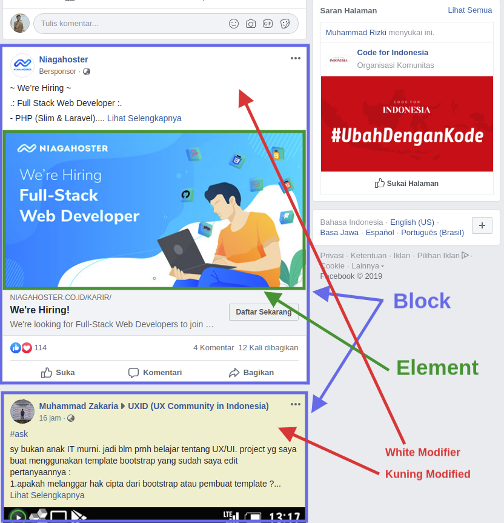

# Block Element Modifier (BEM)



## Block / Blok
Blok adalah sebuah representasi 1 blok component.
contoh : pada gambar diatas terdapat kolom status, kolom status bisa berisi banyak status. setiap status pada facebook dikatergorikan sebagai Block pada BEM 

*status mencakup kotak/blok dari status tersebut

## Element / Elemen
Element merepresentasikan satu bagian dari sebuah block. sebuah block bisa berisinya banyak element

## Modifier / Pengubah
Modifier adalah sebuah tanda/kode yang digunakan untuk mengubah tampilan dan sifat dari block dan element. pada contoh diatas, modifier adalah pengubah tampilan background-color dari block status


## Penulilas BEM
[block]__[element]--[modifier]

### Block
Block ditulis layaknya element pada umumnya menggunakan class
```
.status { ... } // <-- Blok Status
```
### Element
Element ditulis dengan menyertakan block didepannya
```
.status__cover { ... } // <-- Element Cover
```
### Modifier
Modifier juga ditulis dengan menyertakan block didepannya
```
.status--light { ... } <-- light Modifier 
.status--dark { ... } <-- dark Modifier  
```
### Susunan Penulisan

Secara utuh, kode css diatas akan membentuk susunan kode berikut
```
.status { ... }
.status__cover { ...}
.status--dark { ... }
.status--light { ... }
```
Penulisan kode ditulis secara terpisah & tidak menggabungkan sebagaimana penulisan css umumnya
```
.status { ... }
.status .status__cover { ... }
.status .status--dark { ... }
.status .status--light { ... }
```